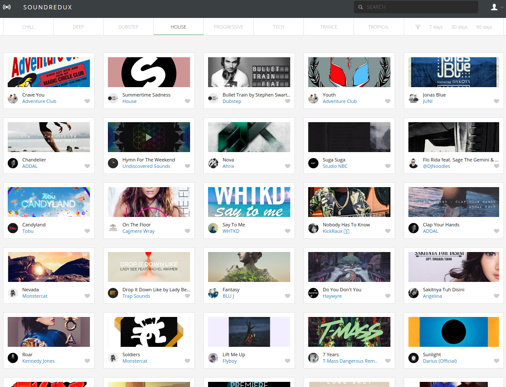

# Redux-SoundCloud

## About
This is the Music Single Application using React/Redux and SoundCloud API.
The Redux-SoundCloud is built by [Big-Silver].

## Quick Start

1. `npm install`
2. `npm run start`
3. visit `http://localhost:8080`

## Install local server

To see user authentication in action in your local environment, install and run the server.

1. Make sure you have [Go](https://golang.org/) installed.
2. Make sure the `sound-redux` folder is in your `$GOPATH`
3. `$ cd server`
4. `$ go get .`
5. `$ go install .`

Once installed you can run the server:
`$ server`

